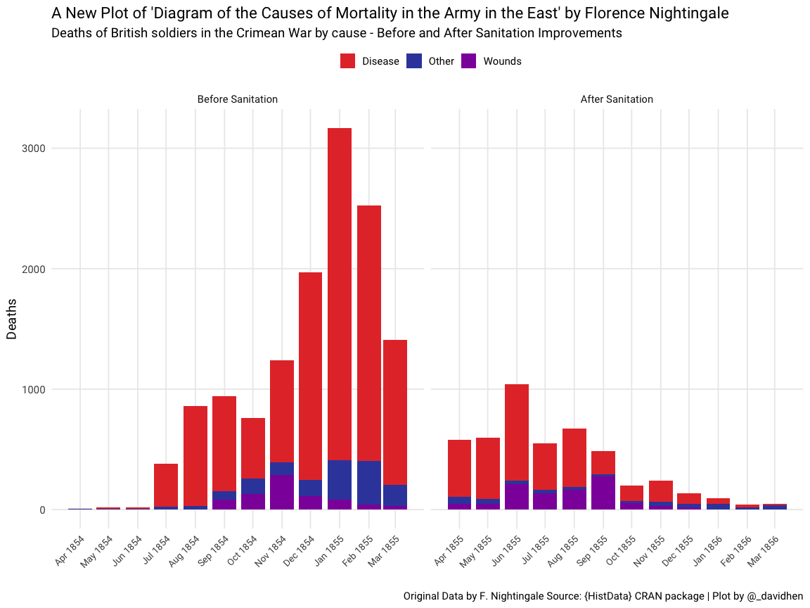
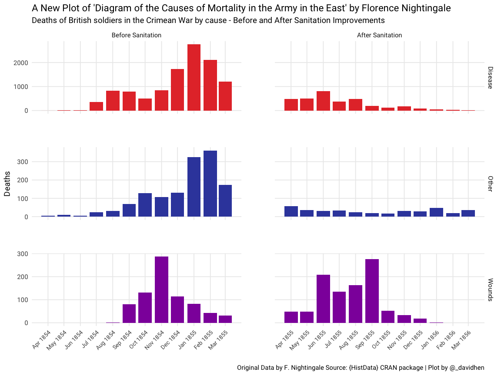

Florence Nightingale redux
================

Following on from @WillBall12’s sterling efforts, I though I’d have a go
at re-imagining Florence Nightingale’s Rose Diagram for the @statsyss
competition.

# Prelims

## Load required packages

Fortunately, the `HistData` package contains all the data we need -
which is neat\!

``` r
library(HistData)
library(tidyverse)
library(lubridate)
library(janitor)
library(here)

theme_set(theme_minimal(base_size = 14, base_family = "Roboto") +
            theme(panel.grid.minor = element_blank()))
colours_davidhen <- c("#e53935", "#3949ab", "#8e24aa", "#039be5",
                      "#00897b", "#7cb342", "#fdd835", "#fb8c00",
                      "#6d4c41", "#546e7a")
```

## Tidy the data

I need to reshape the data and create a factor indicating when the
Sanitation commision arrived.

``` r
Nightingale %>% 
  #Keep only the variables we need
  select(Date, Disease, Wounds, Other) %>% 
  #Create a flag indicating if the data is before or after the sanitation 
  #commision arrived
  mutate(regime = if_else(Date < ymd(18550401), "1", "2"),
         regime = factor(regime,
                         levels = c("1", "2"),
                         labels = c("Before Sanitation",
                                    "After Sanitation"))) %>% 
  #Now reshape to long format
  pivot_longer(cols = Disease:Other, names_to = "cause",
               values_to = "n") %>%
  #tidy up
  clean_names -> my_night
my_night
```

    ## # A tibble: 72 x 4
    ##    date       regime            cause       n
    ##    <date>     <fct>             <chr>   <int>
    ##  1 1854-04-01 Before Sanitation Disease     1
    ##  2 1854-04-01 Before Sanitation Wounds      0
    ##  3 1854-04-01 Before Sanitation Other       5
    ##  4 1854-05-01 Before Sanitation Disease    12
    ##  5 1854-05-01 Before Sanitation Wounds      0
    ##  6 1854-05-01 Before Sanitation Other       9
    ##  7 1854-06-01 Before Sanitation Disease    11
    ##  8 1854-06-01 Before Sanitation Wounds      0
    ##  9 1854-06-01 Before Sanitation Other       6
    ## 10 1854-07-01 Before Sanitation Disease   359
    ## # … with 62 more rows

# Stacked plot

Same as [Will Ball’s
plot](https://twitter.com/willball12/status/1258491398933876737?s=21)
but taking advantage of the `"free_x"` argumeent in `geom_facet()`
(which saves a lot of subsetting)

``` r
my_night %>% 
  ggplot(aes(date, n, fill = cause)) +
  facet_wrap(~regime, scales = "free_x") +
  geom_col() +
  scale_fill_manual(values = colours_davidhen) +
  scale_x_date(breaks = scales::pretty_breaks(n = 10)) +
  theme(axis.text.x = element_text(size = 10,
                                   angle = 45, 
                                   hjust = 1, 
                                   vjust = 1),
        legend.position = "top") +
  labs(title = "A New Plot of 'Diagram of the Causes of Mortality in the Army in the East' by Florence Nightingale",
       subtitle = "Deaths of British soldiers in the Crimean War by cause - Before and After Sanitation Improvements",
       caption = "Original Data by F. Nightingale Source: {HistData} CRAN package | Plot by @_davidhen",
       x = "",
       y = "Deaths", 
       fill = "") -> plot_1
plot_1
```

<!-- -->

# Facet plot

And now with an added facet, again taking advantage of `"free"` scales
which gives a better impression of the before and after difference.

``` r
my_night %>% 
  ggplot(aes(date, n, fill = cause)) +
  facet_grid(cause ~ regime, scales = "free") +
  geom_col() +
  scale_fill_manual(values = colours_davidhen) +
  scale_x_date(breaks = scales::pretty_breaks(n = 10)) +
  theme(axis.text.x = element_text(size = 10,
                                   angle = 45, 
                                   hjust = 1, 
                                   vjust = 1),
        legend.position = "none",
        panel.spacing = unit(4, "lines")) +
  labs(title = "A New Plot of 'Diagram of the Causes of Mortality in the Army in the East' by Florence Nightingale",
       subtitle = "Deaths of British soldiers in the Crimean War by cause - Before and After Sanitation Improvements",
       caption = "Original Data by F. Nightingale Source: {HistData} CRAN package | Plot by @_davidhen",
       x = "",
       y = "Deaths", 
       fill = "") -> plot_2
plot_2
```

<!-- -->

``` r
ggsave(here("plot_1.png"), plot_1, width = 12, height = 9, dpi = 300)
ggsave(here("plot_2.png"), plot_2, width = 12, height = 9, dpi = 300)
```
